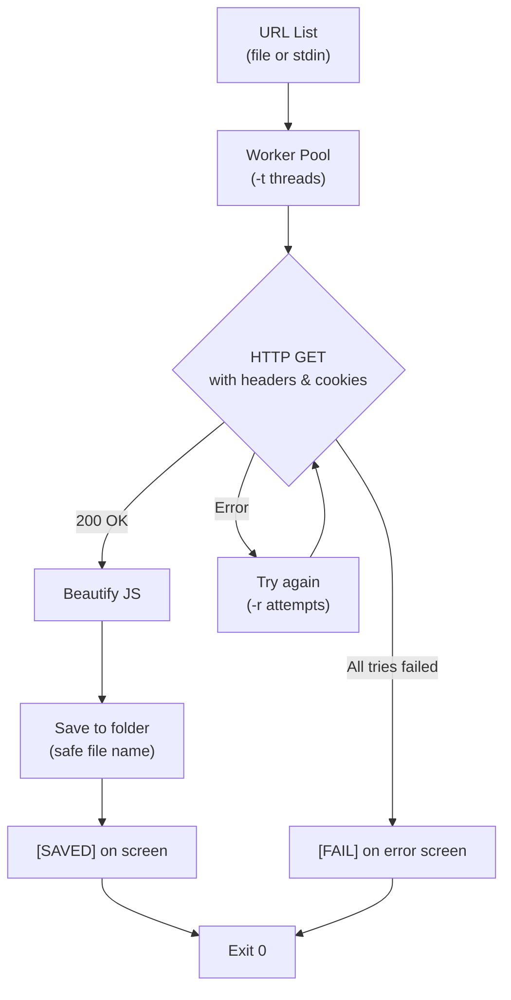

# sangrah

<a href="#features">Features</a> •
<a href="#workflow">Workflow</a> •
<a href="#installation">Installation</a> •
<a href="#usage">Usage</a> •
<a href="#configuration">Configuration</a> •
<a href="#-contributing">Contribution</a>

It takes JavaScript links as input, downloads and beautifies them, then saves them

## The Idea

When you're doing bug bounty hunting or auditing a web application, you end up collecting a lot of JavaScript URLs from crawlers, proxies, source maps, and other tools.

The next step is usually annoying. You either download each file manually or throw together a quick script that stops working as soon as a server rate limits you or returns an error.

Sangrah handles that part for you.

Give it a list of JavaScript URLs and it will download them in parallel, format the code, and save each file with a safe filename. If a request fails, it retries automatically. If it still can't download the file after all retries, it reports the error and continues with the rest of the URLs instead of stopping the whole run.

## How It Works



## Features

* **Download many at once.** Worker pool runs URLs in parallel. Default 10 workers. Change with `-t`.
* **Auto beautify.** Every JS file goes through jsbeautifier. If it fails, you get the original code.
* **Try again on fail.** Waits 1s, then 2s, then 4s, then 8s. Max wait is 10s. Set retry count with `-r`.
* **Custom headers and cookies.** Use `-H` for auth tokens (use it many times). Use `-c` for a Cookie value.
* **Silent mode.** `-s` hides `[SAVED]` lines. Only shows `[FAIL]`. Good for scripts.
* **Safe file names.** Special characters become `_`. `.js` at the end stays.

## Installation

```bash
go install -v github.com/R0X4R/sangrah@latest
```

**From source:**

```bash
git clone https://github.com/R0X4R/sangrah.git && cd sangrah && go install .
```

## Usage

```bash
sangrah -h
```

### Flags

| Short | Long | Default | Description |
| --- | --- | --- | --- |
| `-i` | `--input` |  | File containing URLs (one per line, or pipe to stdin) |
| `-H` | `--header` |  | Add a custom header. Use again for more: `-H 'Key: Value'` |
| `-c` | `--cookie` |  | Cookie header value |
| `-t` | `--threads` | 10 | Number of concurrent downloads (default 10) |
| `-r` | `--retries` | 3 | Retry count on failure (default 3) |
| `-o` | `--output` | `.` | Output directory for downloaded JS files |
| `-s` | `--silent` | false | Suppress per-file progress output |

### Examples

Download URLs from a file:

```bash
sangrah -i urls.txt
```

Pipe with other tools:

```bash
subfinder -d example.tld -silent | httpx -silent | katana -silent | grep -iE '\.js([?#].*)?$|\.js([/?&].*)' | sangrah
```

Use more workers and save files to a folder:

```bash
sangrah -i urls.txt -t 50 -o ./js-dump
```

With auth header and cookie:

```bash
sangrah -i urls.txt -H "Authorization: Bearer eys" -c "session=abc123"
```

## Configuration

If you use the same flags every time, make an alias:

```bash
alias sangrah='sangrah -H "Authorization: Bearer xxx" -o ~/js-dumps'
```

URL files support `#` comments, so you can temporarily disable a URL without removing it.

## 🤝 Contributing

Contributions are welcome. Please fork the repository, make your changes, and submit a pull request. Whether it is code, documentation, or ideas, all help is appreciated.

## Credits

JS beautification by [ditashi/jsbeautifier-go](https://github.com/ditashi/jsbeautifier-go), CLI flags by [projectdiscovery/goflags](https://github.com/projectdiscovery/goflags), colored output by [fatih/color](https://github.com/fatih/color).
